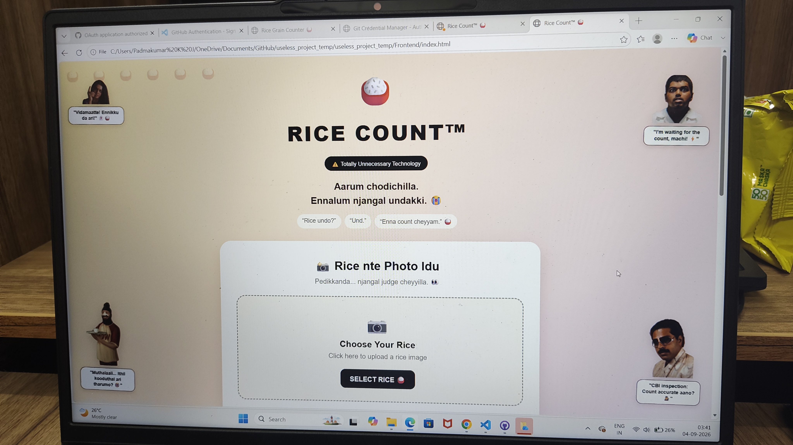
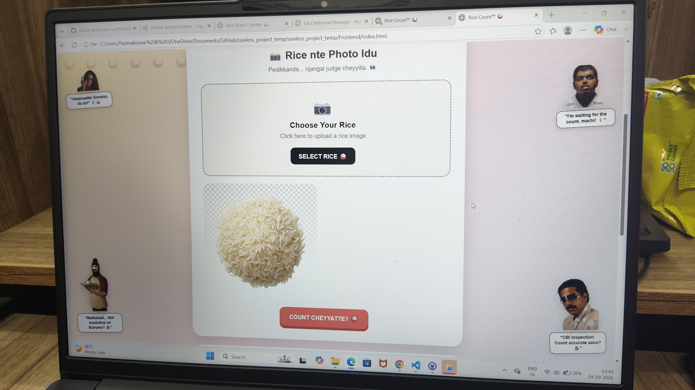
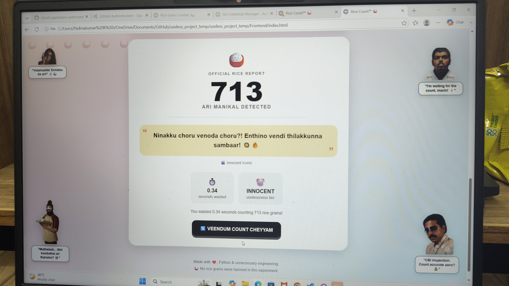

# [RICE COUNTER] 🎯

## Basic Details
### Team Name: [LOGIC EVDE!]

### Team Members
- Member 1: [DEVANANDA TS] - [LBS INSTITUTE OF TECHNOLOGY POOJAPPURA]
- Member 2: [ARADHANA PS] - [LBS INSTITUTE OF TECHNOLOGY POOJAPPURA]

### Project Description
["RICE COUNT" is a fun computer vision project that uses opencv and python to detect and count rice grains from an uploaded image.]

### The Problem (that doesn't exist)
[How can we automatically count the number of rice grains in an image without counting them manually?]

### The Solution (that nobody asked for)
[An image based system that automatically detects and counts individual rice grains using computer vision]

## Technical Details
### Technologies/Components Used
For Software:
- [Languages:Python,HTNL,CSS,JavaScript]
- [Frameworks:Flask]
- [Libraries:OpenCV,NumPy,Pillow(PIL),Flask-CORS]
- [Tools:VS Code,Git,GitHub]

For Hardware:
- [List main components]
- [List specifications]
- [List tools required]

### Implementation
For Software:Upload rice image,Image processing using openCV,Detect rice grains,count grains,display count
# Installation
[commands:pip install flask
pip install flask-cors
pip install opencv-python
pip install numpy
pip install pillow]

# Run
[commands:cd Backend
python app.py]

### Project Documentation
For Software:<video controls src="WhatsApp Video 2026-09-04 at 3.38.03 AM.mp4" title="Title"></video>

# Screenshots (Add at least 3)
![Screenshot1]STAGE 1(
*Rice count application main landing page interface*

![Screenshot2]STAGE 2
*Rice grain image uploaded and ready for processing*

![Screenshot3]STAGE 3))
*Official rice report showing 713 rice grains detected*

# Diagrams 
![Workflow]📸 START
           │
           ▼
   Upload Rice Image
           │
           ▼
     Image Processing
       (OpenCV)
           │
           ▼
    Detect Rice Grains
           │
           ▼
      Count Grains
           │
           ▼
   Generate Result
     ┌─────┴─────┐
     ▼           ▼
🍚 Grain Count   😂 Funny
                Malayalam
                Dialogue
     └─────┬─────┘
           ▼
      Display Result
           │
           ▼
          END

For Hardware:

# Schematic & Circuit

*Add caption explaining connections*

*Add caption explaining the schematic*

# Build Photos

*List out all components shown*

*Explain the build steps*

*Explain the final build*

### Project Demo
# Video
[https://drive.google.com/file/d/1VIIgQ2961hT2BYBexi34jHFVPU_AM1zd/view?usp=sharing]

*It shows how:
📸 An image can be uploaded through a web interface
🔍 OpenCV can process and analyze the image
🍚 Individual rice grains can be detected using image segmentation and contour detection
🔢 The detected grains can be automatically counted
🤖 Python + Flask can connect the image-processing backend with the frontend
😂 The system can generate different Malayalam responses based on the grain count*

# Additional Demos
[Add any extra demo materials/links]

## Team Contributions
- [DEVANANDA TS]: [BACKEND DEVELOPMENT]
- [ARADHANA PS]: [FRONTEND DEVELOPMENT]

---
Made with ❤️ at TinkerHub Useless Projects 

